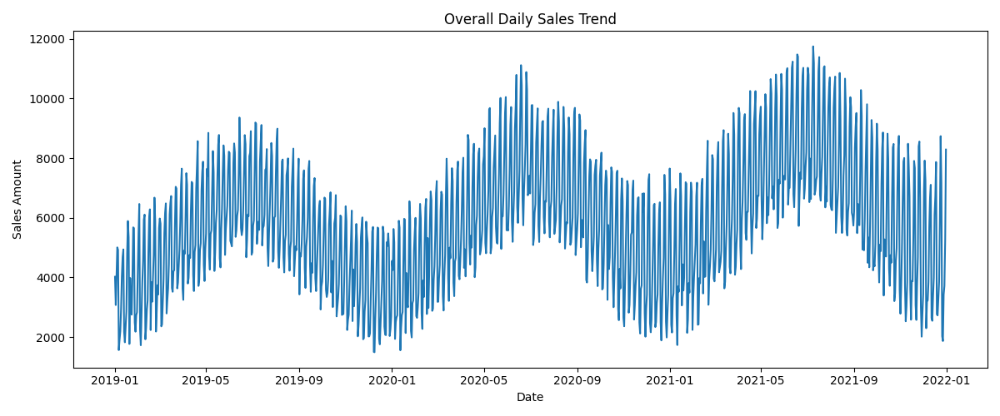
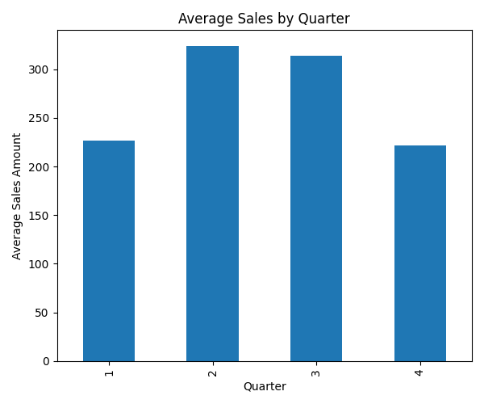
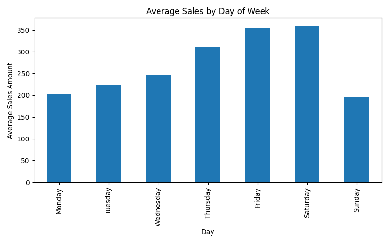

---

# 📊 Sales Forecasting – Data Science (EDA & Preprocessing)

## 1. Project Overview

In a competitive business environment, accurate demand forecasting is critical for decision-making related to sales, production, inventory, and staffing.
This project focuses on **analyzing and forecasting item sales across multiple restaurants over time** using historical transaction data.

This repository follows a **production-style data science workflow**, emphasizing:

- Reproducibility
- Clear separation of concerns
- Explicit business decisions
- Script-based execution (no notebooks)

---

## 2. Business Objective

The primary objectives of the data science phase are:

- Understand historical sales behavior across time
- Identify seasonality, weekly patterns, and trends
- Compare restaurant-level performance
- Prepare a **clean, reliable master dataset** for downstream machine learning and deep learning models

---

## 3. Datasets Used

### Raw Datasets (`data/raw/`)

| File              | Description                                                    |
| ----------------- | -------------------------------------------------------------- |
| `restaurants.csv` | Restaurant identifiers and names                               |
| `items.csv`       | Items sold, mapped to restaurants, including cost and calories |
| `sales.csv`       | Daily sales transactions (item, price, quantity, date)         |

> **Important:**
> Raw datasets are treated as **read-only**. No manual editing or cleaning is performed on raw data.

---

## 4. Data Engineering Pipeline

### 4.1 Ingestion

- CSV files are loaded using explicit schemas
- Dates are parsed as datetime objects
- Memory-efficient dtypes are enforced where possible

### 4.2 Validation (Structural Checks Only)

Validation ensures that the dataset is **safe to process**, not that it is perfect.

Validation checks include:

- Required columns exist
- Referential integrity between sales, items, and restaurants
- Impossible states (e.g., negative prices)

Validation **does not**:

- Impute missing values
- Remove outliers
- Apply business logic

If validation fails, the pipeline **stops immediately**.

---

## 5. Preprocessing & Merge

### 5.1 Business Rules Applied

**Handling non-positive item counts**

- Rows with `item_count <= 0` are removed
- These rows contribute no revenue and distort demand modeling
- The number of dropped rows is logged for transparency

**Join Strategy**

- Sales → Items → Restaurants
- Inner joins only
- Explicit dtype enforcement for join keys to avoid silent corruption

### 5.2 Feature Creation

A new feature is created:

```
sales_amount = price × item_count
```

This becomes the primary metric for:

- Revenue analysis
- Forecasting
- Model evaluation

### 5.3 Output

A single **master dataset** is generated:

```
data/processed/master_sales.csv
```

This dataset serves as the **single source of truth** for all further analysis and modeling.

---

## 6. Exploratory Data Analysis (EDA)

EDA is performed using **pure Python scripts** and saved as static artifacts under:

```
outputs/figures/
```

Each analysis directly answers a business question.

---

### 6.1 Overall Daily Sales Trend



**Observations**

- Clear cyclical behavior over time
- Repeating weekly oscillations indicate strong weekday effects
- Long-term upward and downward movements suggest seasonal influence

**Implication**

- Sales are not random
- Time-aware models are justified
- Simple averages would lose critical structure

---

### 6.2 Average Monthly Sales Trend


**Observations**

- Sales gradually increase from early months
- Peak demand occurs around mid-year
- Sales decline toward year-end

**Implication**

- Strong monthly seasonality exists
- Month and quarter must be included as predictive features
- Forecasting must respect seasonal cycles

---

### 6.3 Quarterly Sales Distribution



**Observations**

- Q2 and Q3 consistently outperform Q1 and Q4
- Q4 shows the lowest average sales

**Implication**

- Business demand is uneven across quarters
- Quarterly planning and forecasting should be differentiated
- Reinforces the importance of time-based feature engineering

---

### 6.4 Average Sales by Day of Week



**Observations**

- Sales increase steadily from Monday through Friday
- Friday and Saturday show peak performance
- Sunday experiences a noticeable drop

**Implication**

- Day-of-week is a **critical predictor**
- Demand is heavily calendar-driven
- Weekend effects must be modeled explicitly

---

### 6.5 Restaurant-wise Performance

Top performing restaurants by total sales:

| Restaurant     | Total Sales Amount |
| -------------- | ------------------ |
| Bob’s Diner    | ~6.3 million       |
| Fou Cher       | ~27.9k             |
| Corner Cafe    | ~16.5k             |
| Surfs Up       | ~15.6k             |
| Beachfront Bar | ~3.8k              |

**Observations**

- Sales distribution across restaurants is **highly skewed**
- Bob’s Diner dominates overall revenue
- Remaining restaurants operate at a much smaller scale

**Implication**

- Global models may be dominated by a single restaurant
- Per-restaurant modeling or normalization may be required
- This insight directly influences modeling strategy in later stages

---

## 7. Key Insights from Data Science Phase

- Sales exhibit **strong temporal structure**
- Weekly and seasonal patterns are clearly present
- Restaurant performance is uneven and skewed
- Calendar-based features are essential for forecasting
- A clean, reproducible master dataset has been established

---

## 8. Deliverables from TASK 1

- ✔ Robust ingestion & validation pipeline
- ✔ Explicit preprocessing with documented business rules
- ✔ Clean master dataset (`master_sales.csv`)
- ✔ Interpretable EDA plots saved as artifacts
- ✔ Business-ready insights to guide modeling decisions

---

## 9. Next Steps

The next phase of the project focuses on **Machine Learning Forecasting**, including:

- Feature engineering from calendar variables
- Time-aware train/test splitting
- Model development using:

  - Linear Regression
  - Random Forest
  - XGBoost

- Performance comparison using RMSE
- One-year sales forecast

---

### ✅ Status

**TASK 1 – Data Science: Completed**

---

If you want, next we can:

- Split this into **Root README + `datascience/README.md`**, or
- Refine wording for **recruiter / portfolio tone**, or
- Proceed to **TASK 2 – Machine Learning** with a clear modeling strategy

Just tell me how you want to proceed.
